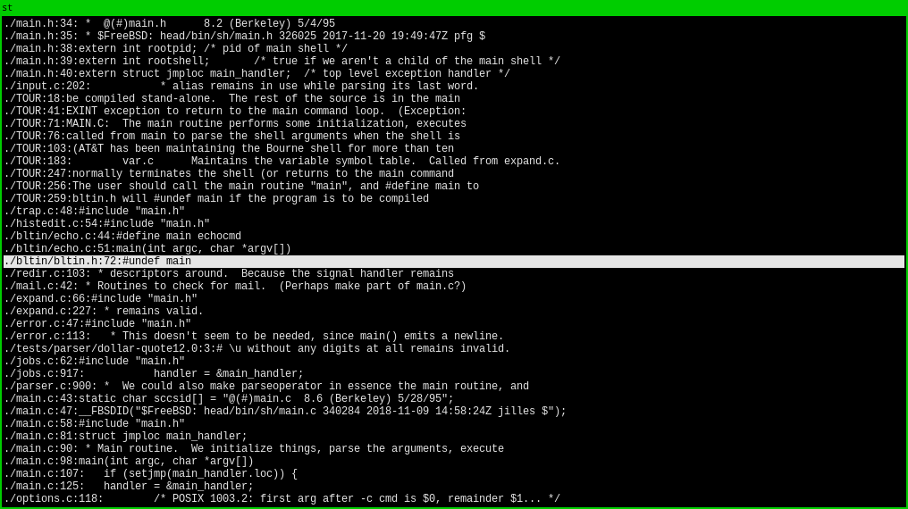

# scb

This is a source code browser to replace my workflow with acme in times when I don't have acme.

## Installation

Compile `scb-select` by running `make`:

```
shell> make
```

Then install `scb` and `scb-select` someplace that's in your `$PATH`. For example,

```
shell> install scb /usr/local/bin
shell> install scb-select /usr/local/bin
```


## How to use scb

To search the keyword `main` in a codebase that's in a folder called `foobarcode`, do

```
shell> scb main /path/to/foobarcode
```

This will bring up the scb viewer. In the viewer you can browse the results of the search and open any result in your default editor set by `$EDITOR`. If `$EDITOR` isn't set, `scb` will default to `vim`.

### Key Bindings

  - *q* -- Quit `scb`.
  - *Up/Down Arrow* -- Select the next line in that direction.
  - *Page Up/Down* -- Scroll half a screen up or down.
  - *Enter* -- Open file in an editor.
  
### Mouse Support

You may scroll with your mouse wheel if it's supported on your system. Right click will open the selected line.

## Screenshot

This is searching for `main` in `/usr/src/bin/sh/` on FreeBSD.


